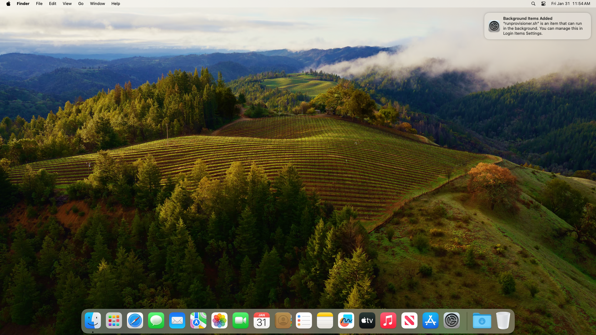
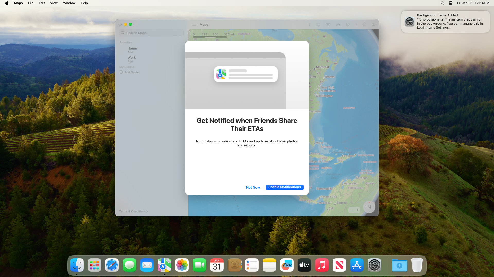
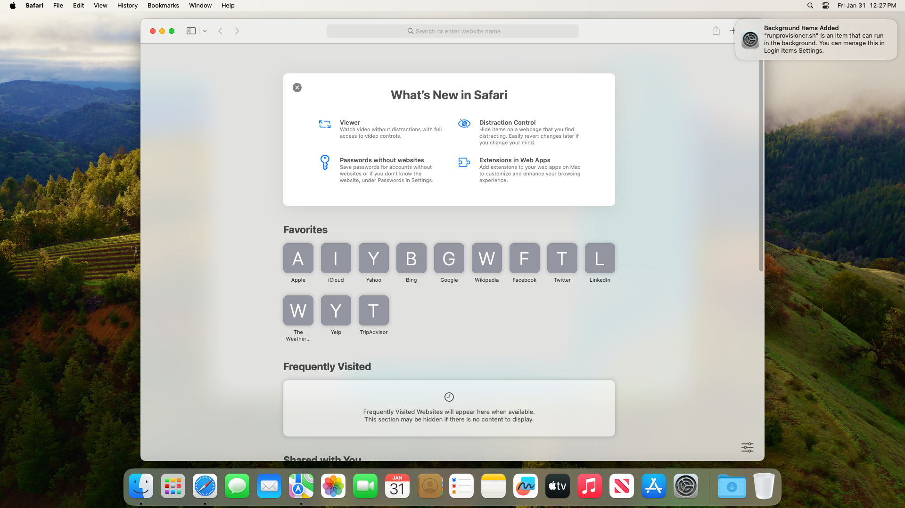
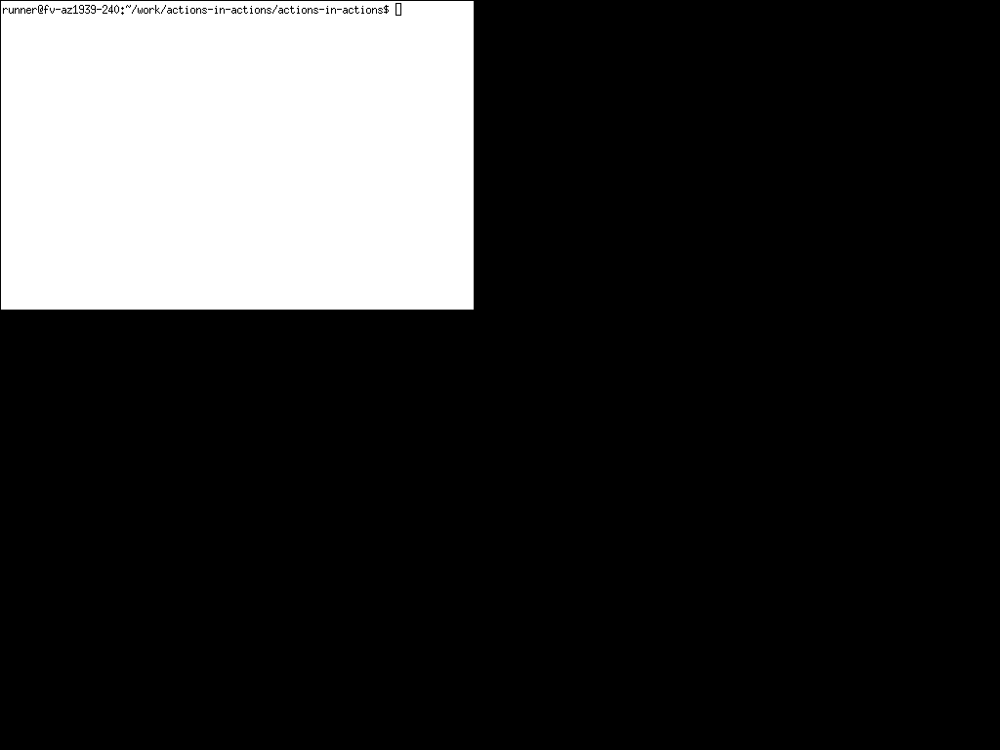

# actions-in-actions

Stupid stuff to do with GitHub Actions.

Takes screenshots on build agents (windows, mac, linux) which looks like the following:

## Mac

Fresh start:

Open maps app:

Open safari:

## Windows

Fresh start:

Open notepad and type some nonsense:

## Ubuntu

it's boring

